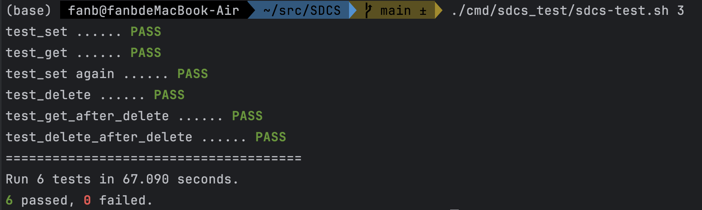

# SDCS
SDCS: Simple Distributed Cache System

实验报告：
- md：[docs/report.md](docs/report.md)
- pdf：[docs/report.pdf](docs/report.pdf)

## 一、本地运行
```shell
# 安装protoc插件
go install google.golang.org/protobuf/cmd/protoc-gen-go@latest
go install google.golang.org/grpc/cmd/protoc-gen-go-grpc@latest
# 编译proto文件
protoc --go_out=. --go_opt=paths=source_relative --go-grpc_out=. --go-grpc_opt=paths=source_relative proto/cache.proto

# 编译sdcs
go mod tidy 
go build -o sdcs ./cmd/sdcs_server/main.go
```
可选择运行[cmd/sdcs_server/local_test](cmd/sdcs_server/local_test)目录下的三个node进行本地集群测试
```shell
go run ./cmd/sdcs_server/local_test/node0.go
go run ./cmd/sdcs_server/local_test/node1.go
go run ./cmd/sdcs_server/local_test/node2.go
```

## 二、docker-compose部署
```shell
# 打包镜像
docker build -t sdcs:v1.0 .

# docker-compose部署
docker-compose -f ./deploy/docker-compose/docker-compose.yml up # 启动
docker-compose -f ./deploy/docker-compose/docker-compose.yml up -d # 后台启动
docker-compose -f ./deploy/docker-compose/docker-compose.yml stop # 停止
docker-compose -f ./deploy/docker-compose/docker-compose.yml down # 停止并删除
docker-compose -f ./deploy/docker-compose/docker-compose.yml down -v # 停止并删除数据卷
docker-compose -f ./deploy/docker-compose/docker-compose.yml restart # 重启
```

## 三、脚本测试
```shell
chmod +x ./cmd/sdcs_test/sdcs-test.sh
./cmd/sdcs_test/sdcs-test.sh 3
```
