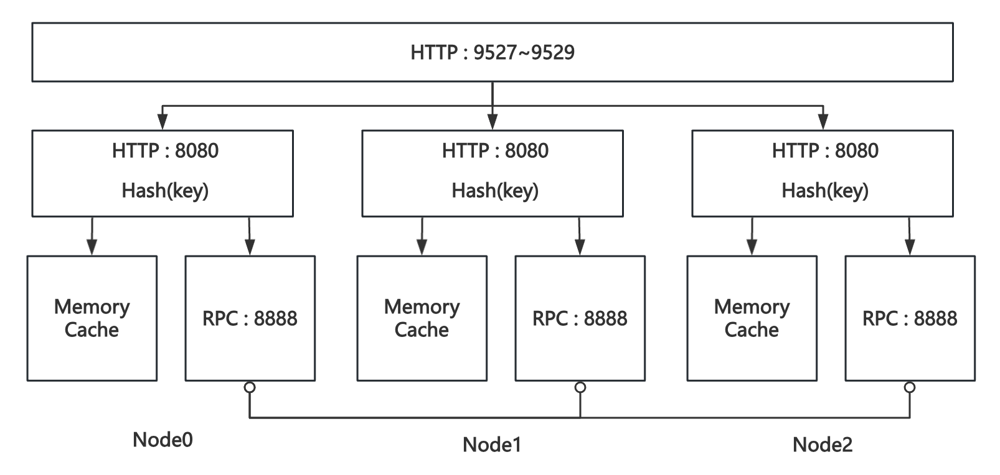

# SDCS实验报告

学号：202421080407
姓名：范彬 

## 一、系统设计

### 1. 系统总体架构设计图


### 2. Cache数据存储设计

- 系统实现了一个基于内存的分布式缓存，采用Key-Value结构存储数据，所有缓存数据仅保存在内存中，不进行持久化存储。这保证了数据操作的高效性，但在服务重启后，数据将会丢失。

- 数据在多个缓存节点之间按照**哈希策略**分布。通过对Key进行哈希计算，将其映射到具体的节点上，从而确保数据在不同节点间的均匀分布，提升系统的负载均衡能力。

- 为了保证系统在并发读写时的数据一致性与操作效率，系统在实现过程中使用了**读写锁**。读写锁允许多个读操作并发进行，提升读性能；而写操作则通过独占锁来保证数据的完整性，避免在并发写入时出现数据竞争问题。

### 3. 集群节点配置设计

- 系统至少启动三个缓存节点，以支持分布式数据管理。节点在启动后不支持动态加入或退出，确保了系统的稳定性与一致性。
- 系统通过**flag标准库**，允许在启动时动态传入集群节点的配置参数，方便灵活地调整节点的设置，适应不同的部署环境。

### 4. HTTP API设计

- 每个节点都提供了HTTP访问入口，支持客户端的读写操作。
- 支持的操作包括：
  - **POST**：写入或更新缓存中的Key-Value数据。
  - **GET**：根据Key读取缓存中的数据。
  - **DELETE**：根据Key删除缓存中的数据。

### 5. 内部RPC接口设计

- 当客户端请求的数据不在接入节点时，接入节点通过内部RPC机制向目标节点发起请求，并将目标节点的结果返回给客户端，确保数据的正确访问。
- 系统采用了开源的gRPC框架，实现高效、可靠的节点间通信，提升了分布式系统的响应速度和稳定性。

## 二、系统实现

### 1. 项目目录结构

```shell
├── Dockerfile
├── LICENSE
├── README.md
├── cmd
│   ├── sdcs_server
│   │   ├── local_test # 本地测试，开启三个进程node0 node1 node2
│   │   │   ├── node0.go
│   │   │   ├── node1.go
│   │   │   └── node2.go
│   │   └── main.go # 主函数
│   └── sdcs_test
│       └── sdcs-test.sh # 测试脚本
├── deploy
│   └── docker-compose
│       └── docker-compose.yml # docker-compose部署脚本
├── docs
│   ├── img
│   │   └── result.png
│   └── report.md # 实验报告
├── go.mod
├── go.sum
├── internal
│   └── cache_server # 缓存实现
│       ├── api.go # HTTP接口
│       ├── cache.go # 缓存服务接口
│       └── rpc.go # RPC接口
└── proto
    └── cache.proto # RPC接口 DDL

```

### 2. Cache实现

- 定义`CacheServer`接口，便于之后扩展其他类型的缓存服务。

```go
type CacheServer interface {
	Start() error
	Stop() error
}
```

- 定义`MemoryCache`结构体，实现上述接口，用作本次实验的基于内存的分布式缓存。

```go
type MemoryCache struct {
	mu                                    sync.RWMutex // 读写锁
	cache                                 map[string]interface{}
	proto.UnimplementedCacheServiceServer // 实现grpc
	config                                MemoryCacheConfig //节点配置
	grpcCli                               []proto.CacheServiceClient // grpc客户端
}

type MemoryCacheConfig struct {
	HttpPort int      // http 端口
	Nodes    []string // 集群rpc地址
	Id       int      // rpc地址所在索引
}

func (mc *MemoryCache) Start() error {
	// start http server
	go func() {
		...
	}()

	// start grpc server
	go func() {
		...
	}()

	// start grpc client
	go func() {
		...
	}()

	return nil
}

func (mc *MemoryCache) Stop() error {
	return nil
}
```

- 实现本地的set、get、delete操作

```go
func (mc *MemoryCache) set(key string, value interface{}) error {
	mc.mu.Lock()
	defer mc.mu.Unlock()
	mc.cache[key] = value
	return nil
}

func (mc *MemoryCache) get(key string) (interface{}, bool) {...}

func (mc *MemoryCache) delete(key string) int {...}
```

### 3. RPC实现

- proto文件

```protobuf
service CacheService {
  rpc Get (GetRequest) returns (GetResponse);
  rpc Set (SetRequest) returns (SetResponse);
  rpc Delete (DeleteRequest) returns (DeleteResponse);
}
...
```

- 实现RPC的Get、Set、Delete

```go
func (mc *MemoryCache) Get(ctx context.Context, req *proto.GetRequest) (*proto.GetResponse, error) {...}

func (mc *MemoryCache) Set(ctx context.Context, req *proto.SetRequest) (*proto.SetResponse, error) {...}

func (mc *MemoryCache) Delete(ctx context.Context, req *proto.DeleteRequest) (*proto.DeleteResponse, error) {...}
```

- 启动RPC服务端

```go
// 注册服务
func (mc *MemoryCache) startRpcServer() error {
	listen, err := net.Listen("tcp", mc.config.Nodes[mc.config.Id])
	if err != nil {
		return err
	}
	s := grpc.NewServer()
	proto.RegisterCacheServiceServer(s, mc)
	log.Printf("RPC server listen on ： %v", listen.Addr())
	err = s.Serve(listen)
	return err
}
```

### 4. HTTP服务实现

- hash函数，判断key对应的节点索引

```go
// 根据key进行hash，并mod n
func hash(key string, n int) int {
	h := fnv.New32a() // 创建 FNV-1a 32位哈希
	h.Write([]byte(key))
	hashValue := h.Sum32()
	return int(hashValue) % n
}
```

- 实现handelGet、handelSet、handelDelete

```go
// GET /{key}
//  1. 正常：返回HTTP 200，body为JSON格式的KV结果；
//  2. 错误：返回HTTP 404，body为空。
func (mc *MemoryCache) handelGet(response http.ResponseWriter, request *http.Request){...}
// POST /
// curl -XPOST -H "Content-type: application/json" http://server2/ -d '{"tasks": ["task 1", "task 2", "task 3"]}'
func (mc *MemoryCache) handelSet(response http.ResponseWriter, request *http.Request){...}
// DELETE /{key}
func (mc *MemoryCache) handelDelete(response http.ResponseWriter, request *http.Request){...}
```

- 不在当前节点，进行RPC调用

```go
// 存储在其他节点，进行rpc调用
		log.Printf("forward to node %d : %s", idx, mc.config.Nodes[idx])
		if mc.grpcCli[idx] == nil {
			mc.startRpcClient()
		}
		ctx, cancelFunc := context.WithTimeout(context.Background(), time.Second*3)
		defer cancelFunc()
		getRes, err := mc.grpcCli[idx].Get(ctx, &proto.GetRequest{Key: key})
```

- 启动HTTP 服务

```go
func (mc *MemoryCache) startHttp() error {
	http.HandleFunc("/", mc.handelHttp)
	addr := fmt.Sprintf("0.0.0.0:%d", mc.config.HttpPort)
	log.Printf("http server listening on %s", addr)
	return http.ListenAndServe(addr, nil)
}
```

## 三、系统测试

### 1. 测试环境

- 本实验在`Docker环境`中运行，使用了`docker-compose`启动多个缓存节点，并通过脚本`sdcs-test.sh`进行了功能验证。
- 容器内部HTTP端口均为8080，分别映射到主机的9527～9529端口
- 容器内部RPC端口均为8888，通过容器域名进行内部通信，其参数配置如下

```yaml
services:
  node0:
    build:
      context: ../..
      dockerfile: Dockerfile
    command: ["/root/sdcs", "-nodes=node0:8888,node1:8888,node2:8888", "-node_id=0"]
    ports:
      - "9527:8080"

  node1:
    build:
      ...
    command: ["/root/sdcs", "-nodes=node0:8888,node1:8888,node2:8888", "-node_id=1"]
    ports:
      - "9528:8080"

  node2:
    build:
      ...
    command: ["/root/sdcs", "-nodes=node0:8888,node1:8888,node2:8888", "-node_id=2"]
    ports:
      - "9529:8080"
```

### 2. 实验结果

- 实验结果如图所示：
  
  
  
  - 系统成功通过了所有的功能测试，各个节点能够正确地响应读写请求，且内部RPC机制运作良好。
  - 测试过程中，系统在高并发下保持了较好的响应速度和数据一致性。
